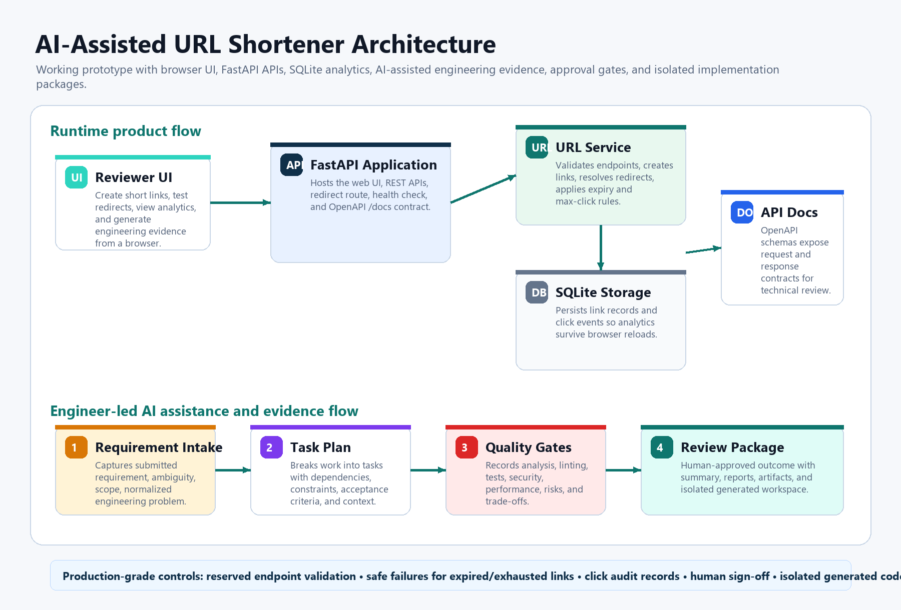
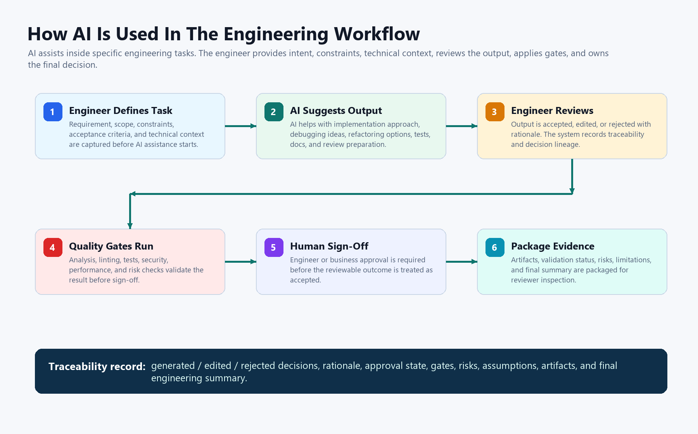
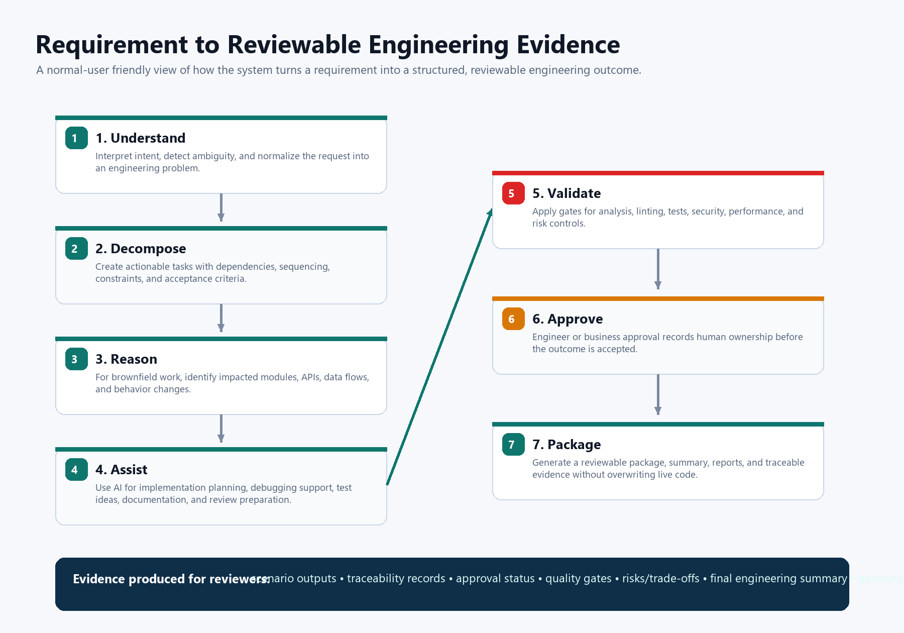

# Deliverables

This page is the reviewer-facing checklist for the submission. It points to the working product, architecture, scenarios, setup, validation, and decision evidence without relying on large raw UI screenshots.

## Visual Summary

### Architecture Overview



### AI-Assisted Engineering Flow



### Requirement To Reviewable Outcome Flow



## 1. Working Prototype

**Status:** Complete

The application is a runnable FastAPI + SQLite URL shortener with:

- Link creation with custom endpoint support.
- Redirect handling through `/r/{endpoint}`.
- Click analytics and last-access tracking.
- Reliability controls for reserved endpoints, disabled links, expiry, and max-click limits.
- Browser UI plus OpenAPI documentation.

Review links:

- Live app: <https://cs-url.onrender.com>
- API docs: <https://cs-url.onrender.com/docs>
- Source code: <https://github.com/ShrihariKoushik/URL_Shortner_AI_Assisted_SDLC/tree/main/ai_assisted_shortener>

Local run:

```powershell
cd ai_assisted_shortener
python -m pip install -r requirements.txt
python -m uvicorn app.main:app --host 127.0.0.1 --port 8010
```

## 2. Architecture Overview

**Status:** Complete

Primary document: [`ARCHITECTURE.md`](./ARCHITECTURE.md)

Architecture evidence covers:

| Area | Evidence |
|---|---|
| Components | FastAPI routes, static UI, Pydantic schemas, service layer, SQLite storage, engineering evidence service, package generator. |
| Tools | Python, FastAPI, SQLite, pytest, ruff, optional OpenAI-compatible Chat Completions. |
| Execution approach | Engineer-led AI assistance with deterministic fallback when no API key is configured. |
| Control flow | URL creation, redirect resolution, analytics, scenario execution, approval, generated-package creation. |
| Key decisions | SQLite for portability, `/r/{endpoint}` redirect prefix, isolated generated workspaces, explicit sign-off gates. |

## 3. Three Scenarios

**Status:** Complete

Primary document: [`SCENARIOS.md`](./SCENARIOS.md)

| Scenario | What it demonstrates |
|---|---|
| Greenfield | A clear new requirement is normalized, decomposed, validated, and summarized. |
| Brownfield | Existing modules, APIs, data flows, and behavior impacts are identified before change output. |
| Ambiguous | Unclear language is detected, assumptions are recorded, and clarification/sign-off gates are shown. |

Each scenario includes requirement understanding, decomposition, AI-assisted execution notes, quality gates, risks, assumptions, limitations, and approval state.

## 4. AI-Assisted Execution Evidence

**Status:** Complete

The system demonstrates AI-assisted engineering rather than unchecked autonomy:

- Engineer provides task intent, constraints, acceptance criteria, and technical context.
- AI assists with implementation planning, debugging support, refactoring ideas, test generation, documentation, and review preparation.
- Outputs are traceable as generated, edited, or rejected with rationale.
- Quality gates cover analysis, linting, tests, security, and performance checks.
- High-impact outputs require human sign-off.
- Generated implementation packages are isolated from the live app for safe review.

## 5. Setup Instructions

**Status:** Complete

Setup is documented in:

- [`README.md`](../README.md)
- Repository root [`README.md`](../../README.md)

Optional OpenAI configuration:

```powershell
copy .env.example .env
# set AI_SHORTENER_OPENAI_API_KEY in .env
```

Without an API key, the app still runs using deterministic fallback evidence generation.

## 6. Testing Approach, Limitations, And Trade-Offs

**Status:** Complete

Primary document: [`TESTING.md`](./TESTING.md)

Validation commands:

```powershell
cd ai_assisted_shortener
python -m pytest -q
python -m ruff check .
```

Testing evidence includes:

- Unit tests for URL service behavior.
- FastAPI integration tests through TestClient.
- Runtime quality gates.
- Security and scope-control tests.
- Generated implementation package validation.

Known trade-offs:

- SQLite is used instead of Redis/Postgres to keep the prototype portable and reviewable.
- Authentication and enterprise observability backends are out of scope for this prototype.
- AI-generated packages are isolated by design; the engineer must review before adoption.

## 7. Backend And API Evidence

**Status:** Complete

FastAPI exposes OpenAPI/Swagger documentation at `/docs`.

Main backend routes:

| Route | Purpose |
|---|---|
| `POST /api/links` | Create a short link. |
| `GET /api/links/{code}/stats` | Read analytics for a link. |
| `POST /api/links/{code}/disable` | Disable a link. |
| `GET /r/{code}` | Redirect through the short endpoint. |
| `POST /engineering/execute` | Generate scenario evidence. |
| `POST /implementation/execute` | Generate isolated implementation package. |
| `GET /implementation/runs/{run_id}/preview` | Preview generated UI package. |
| `GET /implementation/runs/{run_id}/download` | Download generated package. |

## 8. Generated Implementation Package

**Status:** Complete

The UI can generate an isolated package from an approved requirement. The generated workspace includes changed UI files, generated test/doc artifacts, validation metadata, an implementation report, browser preview, and downloadable zip.

This proves safe change management: the live app is not overwritten automatically, and the engineer owns the final adoption decision.

## 9. Compliance Matrix

**Status:** Complete

Primary document: [`COMPLIANCE_MATRIX.md`](./COMPLIANCE_MATRIX.md)

The matrix maps assessment requirements to concrete implementation evidence.
