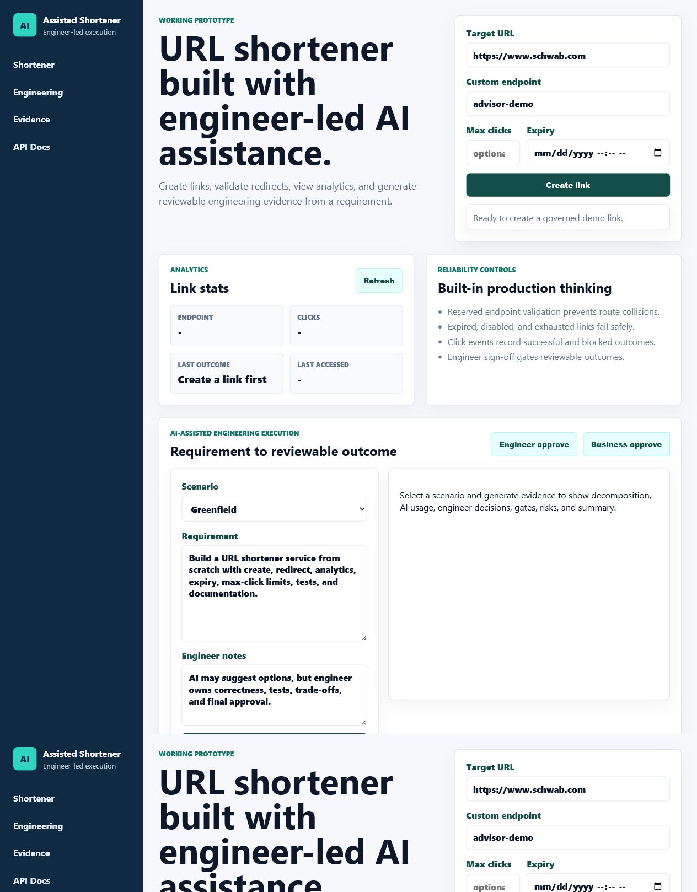
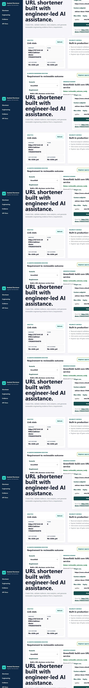
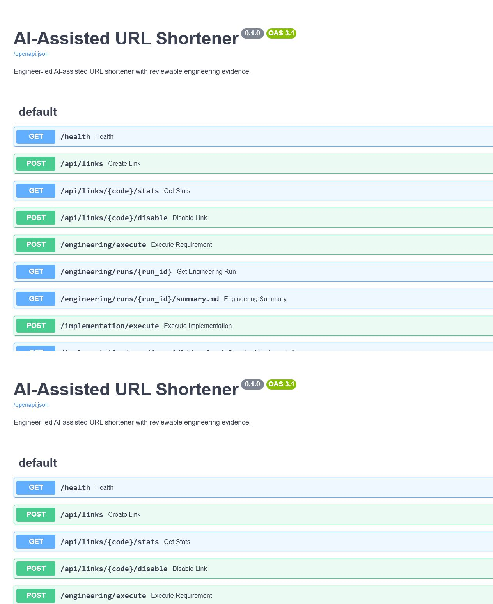

# Deliverables Checklist

This document maps the requested deliverables to the concrete files, screens, and runtime behavior in this submission.

## 1. Working Prototype

**Status:** Complete

The application is a runnable FastAPI + SQLite URL shortener.

Run:

```powershell
cd ai_assisted_shortener
python -m pip install -r requirements.txt
python -m uvicorn app.main:app --host 127.0.0.1 --port 8010
```

Open:

- UI: `http://127.0.0.1:8010/`
- API docs: `http://127.0.0.1:8010/docs`
- Health: `http://127.0.0.1:8010/health`

Screenshot:



## 2. Architecture Overview

**Status:** Complete

Primary document: [`ARCHITECTURE.md`](./ARCHITECTURE.md)

Covers:

- Components: FastAPI routes, Pydantic schemas, SQLite database, URL service, engineering evidence service, implementation package service, static UI.
- Tools: Python, FastAPI, SQLite, pytest, ruff, OpenAI-compatible Chat Completions.
- Execution approach: engineer-led AI assistance with deterministic fallback.
- Control flow: URL shortening, engineering evidence execution, implementation package generation.
- Key decisions: SQLite for prototype, `/r/{code}` redirect prefix, isolated generated packages, sign-off gates.

## 3. Three Scenarios

**Status:** Complete

Primary document: [`SCENARIOS.md`](./SCENARIOS.md)

The UI supports:

- Greenfield: build the core URL shortener from a clear new requirement.
- Brownfield: enhance existing behavior while reasoning about impacted modules/APIs/data flows.
- Ambiguous: identify unclear language, assumptions, and clarification gates before implementation.

Each scenario shows:

- Requirement understanding.
- Task decomposition with dependencies.
- AI-assisted execution phases.
- Codebase reasoning.
- Quality gates.
- Risks, assumptions, and limitations.
- Approval/sign-off state.

Screenshot:



## 4. Setup Instructions

**Status:** Complete

Setup is documented in:

- [`README.md`](../README.md)
- Repository root [`README.md`](../../README.md)

Minimum commands:

```powershell
cd ai_assisted_shortener
python -m pip install -r requirements.txt
python -m uvicorn app.main:app --host 127.0.0.1 --port 8010
```

Optional OpenAI setup:

```powershell
copy .env.example .env
# set AI_SHORTENER_OPENAI_API_KEY in .env
```

## 5. Testing Approach, Limitations, and Trade-offs

**Status:** Complete

Primary document: [`TESTING.md`](./TESTING.md)

Validation commands:

```powershell
cd ai_assisted_shortener
python -m pytest -q
python -m ruff check .
```

Testing approach includes:

- Unit tests for URL service behavior.
- FastAPI integration tests via TestClient.
- Runtime quality gates.
- Security/scope-control tests.
- Generated implementation package validation.

Limitations/trade-offs include:

- SQLite instead of Redis/Postgres for reviewable local prototype.
- Deterministic fallback when no API key is available.
- No authentication or production observability backend.
- Generated packages are intentionally isolated from the live app for safety.

## 6. API and Backend Evidence

**Status:** Complete

FastAPI exposes OpenAPI/Swagger documentation at `/docs`.

Screenshot:



Main backend routes:

- `POST /api/links`
- `GET /api/links/{code}/stats`
- `POST /api/links/{code}/disable`
- `GET /r/{code}`
- `POST /engineering/execute`
- `POST /implementation/execute`
- `GET /implementation/runs/{run_id}/preview`
- `GET /implementation/runs/{run_id}/download`

## 7. Generated Implementation Package

**Status:** Complete

The UI can generate an isolated package from an approved requirement. The generated workspace includes:

- Changed UI files.
- Generated code/test/doc artifacts.
- `IMPLEMENTATION_REPORT.md`.
- `VALIDATION.json`.
- Downloadable zip.
- Browser preview.

Screenshot:


## 8. Compliance Matrix

**Status:** Complete

Primary document: [`COMPLIANCE_MATRIX.md`](./COMPLIANCE_MATRIX.md)

The matrix maps each assessment requirement to the implemented evidence.
