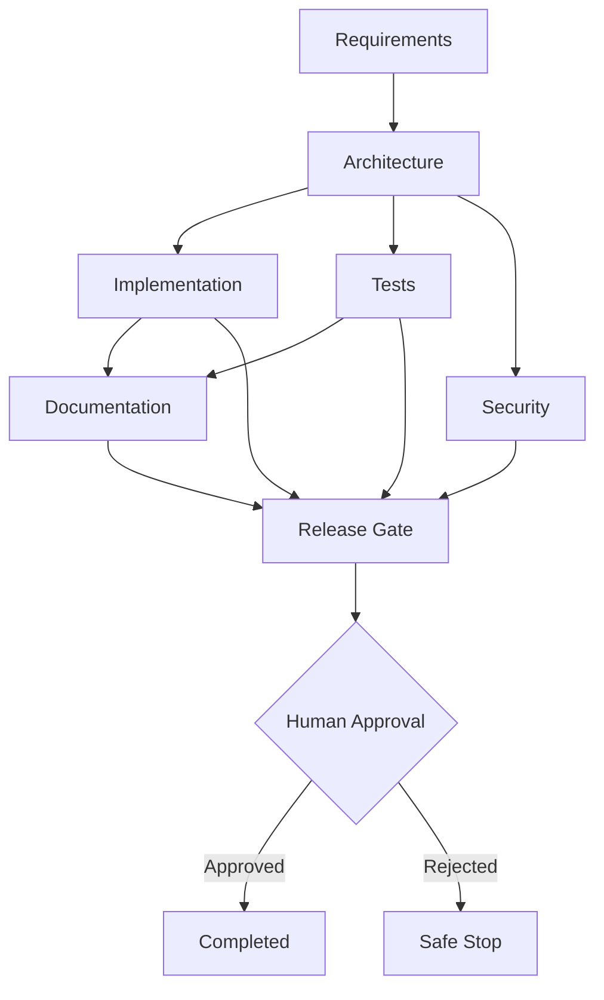

# Architecture Overview

## Components

- FastAPI API layer: exposes URL shortener APIs, health checks, and agentic workflow endpoints.
- UrlService: owns slug allocation, redirect resolution, and analytics updates.
- SQLite persistence: stores shortened URLs and click analytics for a runnable local prototype.
- SDLC orchestrator: executes requirement, architecture, implementation, test, security, documentation, and release stages as a DAG.
- Audit logger: writes append-only JSONL events for workflow traceability.
- LLM client: uses OpenAI when `OPENAI_API_KEY` is set and a deterministic fallback otherwise.

## Control Flow

Brownfield runs insert impact analysis before architecture. Ambiguous runs insert a clarification checkpoint before architecture. Implementation, tests, and security are independent children of architecture, so the graph models parallelizable SDLC work with synchronization at documentation and release readiness.

## Governance

- Entry gates prevent downstream execution when required context is missing.
- Exit gates validate each stage output before dependents can run.
- High-impact nodes require human approval when `REQUIRE_HUMAN_APPROVAL=true`.
- Bounded retries and fallback are implemented at node level.
- Rollback hooks can mark release candidates unavailable if a readiness gate fails.
- Safe-stop occurs when a human rejects an approval checkpoint.
- Decision lineage is preserved in run context and audit events.

## Reliability Metrics

Each workflow run tracks success rate, retry count, rollback count, fallback count, MTTR, and end-to-end latency. These metrics are returned from `/agent/runs/{run_id}` and can be scraped into an external observability system in a production deployment.

